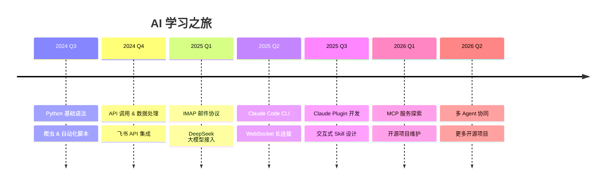

<!--
                   _      _             _
  ___ _   _  ___ __| | ___| |_ _   _  __| | ___  _____   __
 / __| | | |/ _ \ \ / / _ \ __| | | |/ _` |/ _ \/ _ \ \ / /
| (__| |_| | (_) \ V /  __/ |_| |_| | (_| |  __/ (_) \ V /
 \___|\__,_|\___/ \_/ \___|\__|\__,_|\__,_|\___|\___/ \_/

          AI 不是替代人类，是替代那些不会使用 AI 的人。
-->

<h1 align="center">
  
</h1>

  
  
  
  
  

---

## 🚀 项目作品

<table>
<tr>
<td width="50%">

### 🔗 飞书桥接 · Feishu Bridge

飞书 ↔ Claude Code 双向桥接。在飞书群/私聊发消息，Claude 处理后自动回复。

`Python` `飞书API` `WebSocket` `Claude CLI`

</td>
<td width="50%">

### 📬 邮件日报 · MailDigest

多邮箱自动读取 → DeepSeek AI 分类 → 飞书卡片推送。7大分类 + 紧急度标注。

`Python` `IMAP` `DeepSeek` `飞书Webhook`

</td>
</tr>
</table>

---

## 📈 AI 学习路线

---

## 🛠 技术能力

**语言 & 工具**

**AI & 自动化**

**插件 & 市场**

---

## 📊 统计

  
  

  

---

  <a href="https://choudududechou-dev.github.io">🌐 个人网站</a>
  ·
  <a href="mailto:choudududechou@gmail.com">📧 邮箱</a>
  ·
  <a href="https://github.com/choudududechou-dev/claude-plugins">🔌 插件市场</a>

---

  Built with ❤️ and Claude Code

